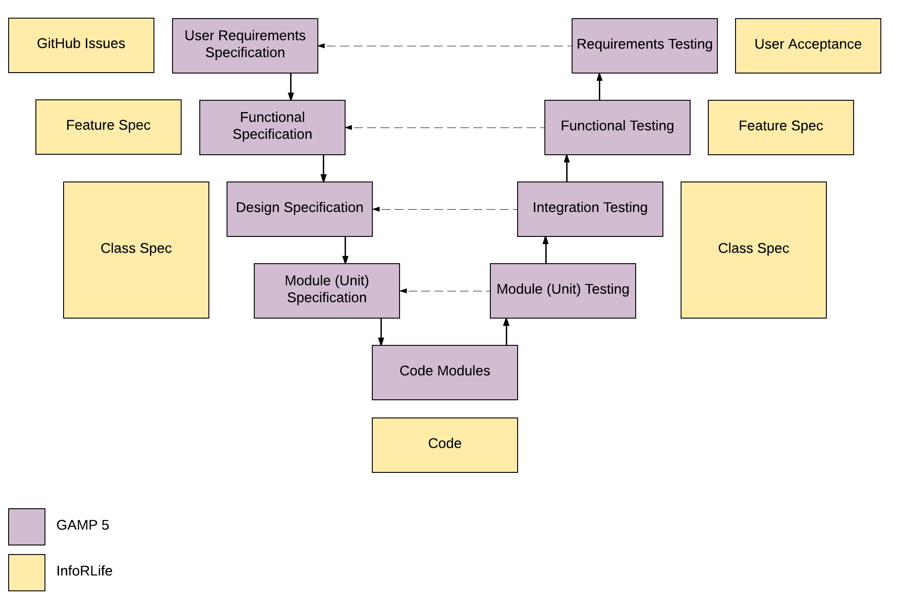

When it comes to validating computerized systems in the pharmaceutical industry, there are several guidelines but not regulations. Therefore, it is not possible to ensure a process produces qualified software by following a set of rules.

Among all the guidelines dealing with computer system validation ones of the most, if not the most, commonly accepted within the industry are those defined by the [GAMP5 framework](https://www.ispe.org/publications/guidance-documents/gamp-5).

GAMP’s approach can be summarized by its V model which relates the specifications created for a system with the testing performed during its validation.

To have a comprehensive overview of the quality of our process, we have compared the GAMP5 framework with our process. The results are below.

{:width="100%"}

Instead of managing user requirements in a single document as the GAMP framework suggests, we found more convenient managing them individually as [GitHub Issues](https://guides.github.com/features/issues/). Having the requirements directly in GitHub allows us to have full [traceability](https://inforlife.github.io/process/traceability.html) from definition to release, something impossible to achieve when requirements are managed on paper. Furthermore, since the requirements are online, we have access to them regardless our location. This simplifies their definition, approval, and acceptance.  

Instead of following GAMP's approach, and defining a series of documents (functional, design, module specifications) after the requirements have been collected (and approved), implementing the requirements, and then verifying the correctness of each level of specification within a dedicated collection of tests, we specify the behavior our applications should have and test it while developing them directly in code.

For each issue we implement, we write several executable specifications which, at the same time, define what the software is supposed to do and, when executed, verify the software does what the specifications say it does.
We usually define [two types of specifications, feature and class specifications](https://inforlife.github.io/process/test-driven-development.html#specifications). We believe having executable specifications is fundamental to improve code quality since it allows us to find problems much earlier than using the approach suggested by GAMP. We can (and do many times per day) run the set of specifications locally with a single command and, thanks to the integration we have in place between GitHub and the CI services, the entire suite runs after every push to GitHub. We don't have to wait for weeks or even months before discovering something is not working as expected. We find problems in minutes of their creation. This permits us to address them quickly and in a more efficient way since we are still working on the faulty issue.

Furthermore, specifications written on paper has the risk to become outdated and not reflect the current system. Our specifications are easy to update, since they are within the code base, and cannot become obsolete without we notice it right away.

Finally, GAMP recommends executing some requirements testing to verify the correctness of the user requirements specification.
Since we have already verified the application does what the user requirements say on our feature specifications, as the last step we wish to make sure we correctly understood [what the person who opened the issue asked for](https://inforlife.github.io/process/iterations.html#user-acceptance). This confirms for us not only we write the code right but also we write the right code.

To conclude, we think an application developed with our process is at least good as one which followed the guidelines indicated by GAMP.
